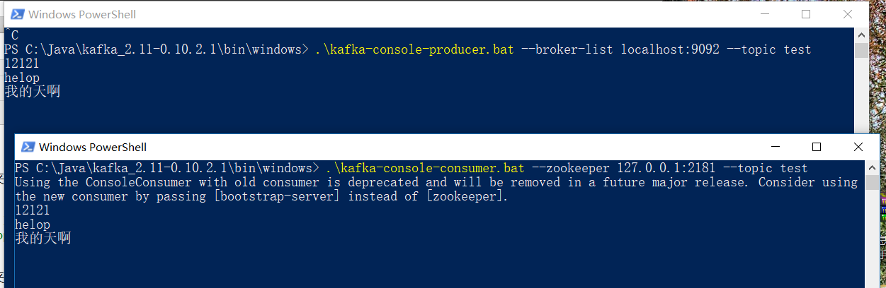

# windows下安装kafka
> 注意：请确保本地Java环境变量配置成功

## 1.安装Zookeeper 
Kafka的运行依赖于Zookeeper，所以在运行Kafka之前我们需要安装并运行Zookeeper 

1.1 下载安装文件： http://mirror.bit.edu.cn/apache/zookeeper/ 

1.2 解压文件（本文解压到 D:\zookeeper-3.4.8） 

1.3 打开D:\zookeeper-3.4.8\conf，把zoo_sample.cfg重命名成zoo.cfg 

1.4 从文本编辑器里打开zoo.cfg 

1.5 修改dataDir和dataLogDir保存路径 

	dataDir=D:\data\logs\zookeeper 
	dataLogDir=D:\data\logs\zookeeper 

1.6 添加如下系统变量：ZOOKEEPER_HOME: D:\zookeeper-3.4.8 
Path: 在现有的值后面添加 ;%ZOOKEEPER_HOME%\bin; 

1.7 运行Zookeeper: 打开cmd然后执行zkserver 命令。如果打印以下信息则表示zookeeper已经安装成功并运行在2181端口。 
	
	2017-12-08 14:39:10,048 [myid:] - INFO  [main:Environment@100] - Server environment:user.home=C:\Users\TCDD
	2017-12-08 14:39:10,049 [myid:] - INFO  [main:Environment@100] - Server environment:user.dir=C:\Users\TCDD
	2017-12-08 14:39:10,060 [myid:] - INFO  [main:ZooKeeperServer@825] - tickTime set to 2000
	2017-12-08 14:39:10,061 [myid:] - INFO  [main:ZooKeeperServer@834] - minSessionTimeout set to -1
	2017-12-08 14:39:10,061 [myid:] - INFO  [main:ZooKeeperServer@843] - maxSessionTimeout set to -1
	2017-12-08 14:39:10,103 [myid:] - INFO  [main:ServerCnxnFactory@117] - Using org.apache.zookeeper.server.NIOServerCnxnFactory as server connection factory
	2017-12-08 14:39:10,226 [myid:] - INFO  [main:NIOServerCnxnFactory@89] - binding to port 0.0.0.0/0.0.0.0:2181

## 2.安装并运行Kafka 

2.1 下载安装文件： http://kafka.apache.org/downloads.html 

2.2 解压文件（本文解压到 D:\kafka_2.11-0.10.2.0） 

2.3 打开D:\kafka_2.11-0.10.2.0\config\ server.properties 

2.4 把 log.dirs的值改成 
	
	log.dirs=D:\data\logs\kafka 

配置文件说明：

	#当前机器在集群中的唯一标识，和zookeeper的myid性质一样
	broker.id=0 
	#当前kafka对外提供服务的端口默认是9092
	port=9092
	#这个参数默认是关闭的，在0.8.1有个bug，DNS解析问题，失败率的问题。
	host.name=192.168.7.100
	#这个是borker进行网络处理的线程数
	num.network.threads=3
	#这个是borker进行I/O处理的线程数
	num.io.threads=8
	#消息存放的目录，这个目录可以配置为“，”逗号分割的表达式，上面的num.io.threads要大于这个目录的个数这个目录，
	#如果配置多个目录，新创建的topic他把消息持久化的地方是，当前以逗号分割的目录中，那个分区数最少就放那一个
	log.dirs=/opt/kafka/kafkalogs/
	#发送缓冲区buffer大小，数据不是一下子就发送的，先回存储到缓冲区了到达一定的大小后在发送，能提高性能
	socket.send.buffer.bytes=102400
	#kafka接收缓冲区大小，当数据到达一定大小后在序列化到磁盘
	socket.receive.buffer.bytes=102400
	#这个参数是向kafka请求消息或者向kafka发送消息的请请求的最大数，这个值不能超过java的堆栈大小
	socket.request.max.bytes=104857600
	#默认的分区数，一个topic默认1个分区数
	num.partitions=1
	#默认消息的最大持久化时间，168小时，7天
	log.retention.hours=168
	#消息保存的最大值5M
	message.max.byte=5242880
	#kafka保存消息的副本数，如果一个副本失效了，另一个还可以继续提供服务
	default.replication.factor=2
	#取消息的最大直接数
	replica.fetch.max.bytes=5242880
	#这个参数是：因为kafka的消息是以追加的形式落地到文件，当超过这个值的时候，kafka会新起一个文件
	log.segment.bytes=1073741824
	#每隔300000毫秒去检查上面配置的log失效时间（log.retention.hours=168 ），到目录查看是否有过期的消息如果有，删除
	log.retention.check.interval.ms=300000
	#是否启用log压缩，一般不用启用，启用的话可以提高性能
	log.cleaner.enable=false
	#设置zookeeper的连接端口
	zookeeper.connect=192.168.7.100:12181,192.168.7.101:12181,192.168.7.107:1218 
	

2.5 D:\kafka_2.11-0.10.2.0\bin文件夹下的.sh命令脚本是在shell下运行的，此文件夹下还有个 windows文件夹，里面是windows下运行的.bat命令脚本 

2.6 在D:\kafka_2.11-0.10.2.0文件夹中”Shift+鼠标右键”点击空白处打开命令提示窗口 
2.7 输入并执行一下命令以打开kafka:

	.\bin\windows\kafka-server-start.bat .\config\server.properties

显示的信息如下，则表示正常运行 
	
	[2017-12-08 15:54:44,368] INFO [GroupCoordinator 0]: Starting up. (kafka.coordinator.GroupCoordinator)
	[2017-12-08 15:54:44,369] INFO [GroupCoordinator 0]: Startup complete. (kafka.coordinator.GroupCoordinator)
	[2017-12-08 15:54:44,371] INFO [Group Metadata Manager on Broker 0]: Removed 0 expired offsets in 2 milliseconds. (kafka.coordinator.GroupMetadataManager)
	[2017-12-08 15:54:44,388] INFO Will not load MX4J, mx4j-tools.jar is not in the classpath (kafka.utils.Mx4jLoader$)
	[2017-12-08 15:54:44,413] INFO Creating /brokers/ids/0 (is it secure? false) (kafka.utils.ZKCheckedEphemeral)
	[2017-12-08 15:54:44,419] INFO Result of znode creation is: OK (kafka.utils.ZKCheckedEphemeral)
	[2017-12-08 15:54:44,422] INFO Registered broker 0 at path /brokers/ids/0 with addresses: EndPoint(DESKTOP-ADQ0RMT,9092,ListenerName(PLAINTEXT),PLAINTEXT) (kafka.utils.ZkUtils)
	[2017-12-08 15:54:44,425] WARN No meta.properties file under dir C:\Java\kafka_2.11-0.10.2.1\log\meta.properties (kafka.server.BrokerMetadataCheckpoint)
	[2017-12-08 15:54:44,453] INFO Kafka version : 0.10.2.1 (org.apache.kafka.common.utils.AppInfoParser)
	[2017-12-08 15:54:44,453] INFO Kafka commitId : e89bffd6b2eff799 (org.apache.kafka.common.utils.AppInfoParser)
	[2017-12-08 15:54:44,456] INFO [Kafka Server 0], started (kafka.server.KafkaServer)

## 3.创建topics 
3.1在D:\kafka_2.11-0.10.2.0\bin\windows文件夹中”Shift+鼠标右键”点击空白处打开命令提示窗口

	.\kafka-topics.bat --create --zookeeper 127.0.0.1:2181 --replication-factor 1 --partitions 1 --topic test
	#解释
	#	--replication-factor 2		复制两份
	#	--partitions 1 				创建1个分区
	#	--topic 					主题为test

更多请看 [官方文档](http://kafka.apache.org/documentation.html)

## 4.打开一个Producer 
4.1在D:\kafka_2.11-0.10.2.0\bin\windows文件夹中”Shift+鼠标右键”点击空白处打开命令提示窗口

	.\kafka-console-producer.bat --broker-list 127.0.0.1:9092 --topic test

## 5.打开一个Consumer 
5.1在D:\kafka_2.11-0.10.2.0\bin\windows文件夹中”Shift+鼠标右键”点击空白处打开命令提示窗口

	.\kafka-console-consumer.bat --zookeeper 127.0.0.1:2181 --topic test

注意：以上打开的窗口不要关闭 
然后就可以在Producer控制台窗口输入消息了。在消息输入过后，很快Consumer窗口就会显示出Producer发送的消息 

## 6. 其他命令

6.1 查看topic状态
	
	#就会显示我们创建的所有topic
	./kafka-topics.bat --list --zookeeper 127.0.0.1:2181

6.2 查看topic状态

	./kafka-topics.bat --describe --zookeeper 127.0.0.1:2181 --topic test
	#下面是显示信息
	Topic:ssports    PartitionCount:1    ReplicationFactor:2    Configs:
    Topic: test    Partition: 0    Leader: 1    Replicas: 0,1    Isr: 1
	#分区为为1  复制因子为2   他的  shuaige的分区为0 
	#Replicas: 0,1   复制的为0，1